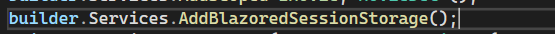

## Routing and Navigation

> using code behind

- 
- behind the razor pages (xyz.razor) , we can create code behind files (C# files)with using(xyz.razor.cs)
- 
- when file name is not matching with the class name , we need to use `@inherits Classname` in the .razor file

> Routing

- 
- 
- 
- 
- 
- 
- 

> implemenation

- 
- 
- code for blazor to connect with webapi
  - 

> sesssion variable in Blazor

- 
- 

> summary

- 
- dependency injection -> changes in one place will not affect the other place
- 
