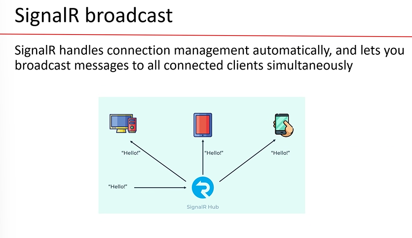

## Blazor Language features

- interop -> sharing the resources(when 2 languages are communicating with eachother , it is called interop)
- 
- 
- 
- 
- 

## Parent and Child communication

- 
- something which is calling -> parent
- something which is being called -> child
- 
- 
- 
- 

## SignalR

- 
- 
- 
- jquery syntax for button :
  - 
