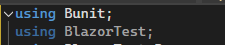
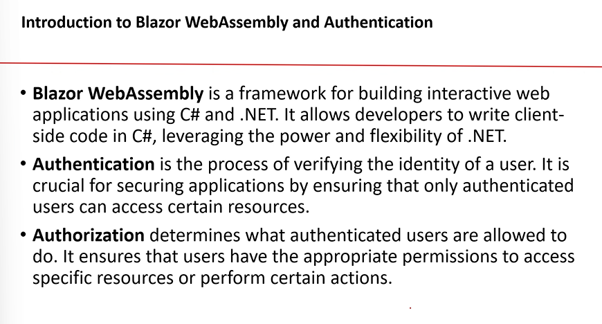

## Blazor Level-2

### Unit Testing

- 
- 
- need to import this namespace
  - 
  - 
- 
- 

### Authentication

- 
- 
- 
- 
- Authentication state provider : it is a base class which provides auth state inf, this class contains a method by name notifyauthenticationstatechanged - which is used to notify applic weather the user authenticated or not.
- 
- Authentication state : has property called `isAuthenticated()`-> checks whether the person has permission to see the page , returns boolean value(ex: person should be logged in & role="Admin")
- namespace to be included : 
- 
- things to be added in program.cs: 
- 
- 
