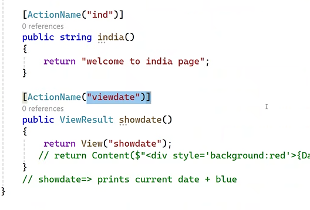

- Asp.Net -> used for website creation

## MVC

- Architectural pattern -> i.e, dividing the things
  
  

- 3 mandatory files for every MVC project -> views ,model , controller
- model file is created automatically (contains all database related logic)(contains context and model files)
- in MVC for all the web pages the `cs file` is centralized.i.e, logic of all the pages are there in only one cs file. (controller)
- In Mvc , each and every layer are independent (i.e, change in logic may not effect the database and viceversa) , whereas in Razor changes in one layer will effect the whole layers
  
- in all other technologies the UI(user interface) is called directly by using the file name. but in case of MVC there is no need of knowing the name of file(i.e, in MVC the file canot be called directly)
- 
- 
- App_Data -> stores temporary files
- App_Start -> contains .cs files
- Context -> contains styles files

### Controller

- contains .cs files
- handles user request
- 

### Model

- contains all database related files
- 

### Views

- 

> URL in MVC

- 

> A Tag preffered over using href

- 

## Action Methods

- 

## Action Result(list of return types)

- 

### Passing Data from controller to view

- 
- 3 methods:
  - ViewData
    - 
    - in viewdata the redirection is not possible , i.e, it becomes null when redirected (only used to a particular method & its view only, cannot be used in other views)
    - the data assigned will always be an object
  - ViewBag
    - the data assigned will always be the same data type as given
    - 
    - Difference between ViewBag and ViewData(type casting)
      - 
  - TempData
    - 
    - we can use values in other views as well by using the keyword `keep`
      - 

## Action selectors

- 
- Action Name
  - 
  - if the view name and method name are different , we can use as below
    - 
- No Action
  - 
  - 
- Action Verbs
  - 
  - useful when working with UI
  - Get method -> executed when request to a server(when request a page using url)
  - post method -> executed when after submitting the page
  - 
  - 

> IActionResult -> returns not only view, it returns string , javascript , json etc..

> ViewResult -> returns only view
