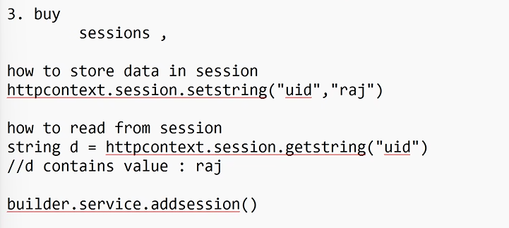

1. login page
2. registration page -> validation[required,minlength,maxlength,custom validation , email]
   - System.componentmodel.dataannotation
3. 

- real time applications :
  - login
  - logout
  - search page
    - no.of products found
    - no products found
  - Buy page
