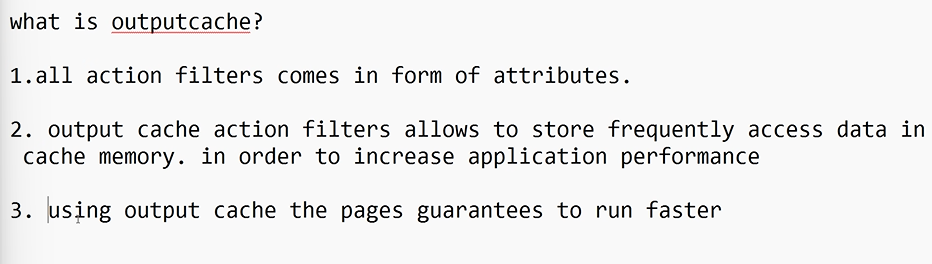
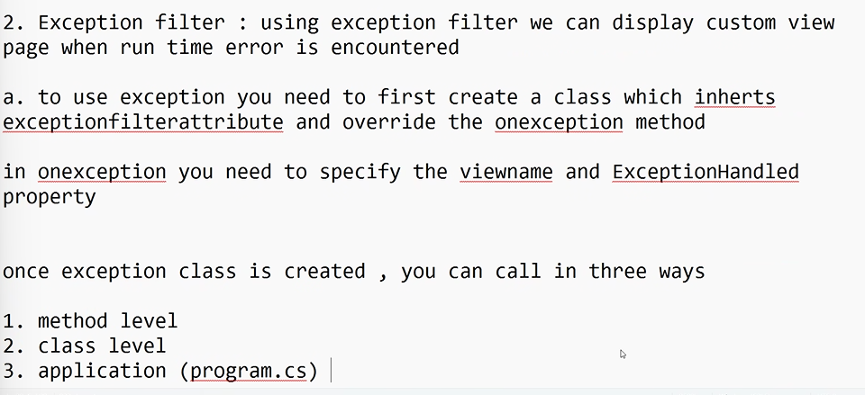
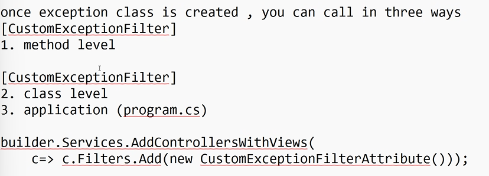
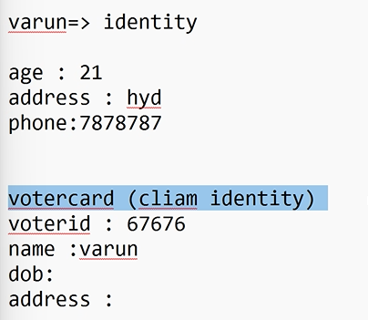

> partial view

    - it is also called as reusable views
    - in partial views u can create UI and reuse across multiple pages
    - partal views are created using partialview return type instead of actionresult

## Action filters

- a set logic which is applied before or after calling action methods
- all action filters comes in form of attributes(i.e, written in `[]` like `[HttpGet]` & `[Httppost]`)
- Action filters are used for methods which are lengthy and consume more time to execute(i.e, method is exectued once and used whenever needed)

1. Outputcache
   - 
   - namespace should be added: `builder.Services.AddOutputCache();` and `app.UseOutputCache();`
2. Exception

   - using exception filter we can display custom view page when run time error is encountered(i.e, centailized way of handling run time errors)
   - we need to create a class for this

   ```c#
   public class CustomExceptionFilterAttribute : ExceptionFilterAttribute
    {
        public override void OnException(ExceptionContext context)
        {
            context.Result = new ViewResult { ViewName = "Error" };
            context.ExceptionHandled = true;
        }
    }
   ```

   - to declare it globally(to handle exceptions globaly)

   ```c#
    builder.Services.AddControllersWithViews(
    c=> c.Filters.Add(new CustomExceptionFilterAttribute()));
   ```

   - 
   - 

3. Authentication

   - .Net supports many kind of authentication
     1. Cookie based authentication
        - in cookie based authentication , we use collections of claims and identities to handle this
        - we also use cookie file (text file) in this type
        - how cookie based authentication works?
          - claims
          - claim identity -> identity contains 1 or more claims
          - claim principal -> collection of identities (contains one or more identity)
        - claim
          - piece of information regarding particular object/person
          - claim always comes in key value based
          - 
     2. JWT authentication
        - JWT -> json web token
        - this type of authentication is very widely used in web api
     3. oauth authentication
        - in this type of authentication , we use external web site to get user information,instead of managing users manually
