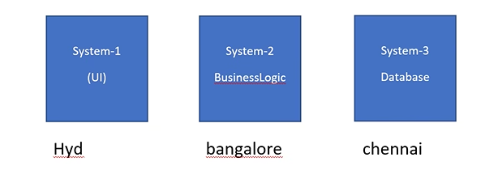
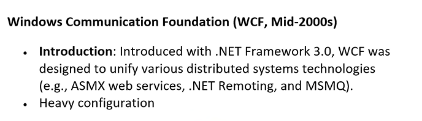

# WEB API

## Distributed Computing

- 
- componets of a software
  1. user interface(html,javascript,css,cshtml,bootstrap)
  2. business logic(controller,classlibrary,cs)/Model
  3. Database(sql server/oracle,mysql,mongo,excel,xml etc..)
- Advantages of Distributed Computing
  - team members can work simultaneously
  - faster development
  - single point failure can be avoided
  - power of multiple systems(RAM,Harddisk)
  - load balancing
- distributed means it can be same network / different network
  - 
- microsoft way to handle distributed computing

  1. Remoting (.net) -> RMI(Java)
     - 
     - works between same technology(i.e, the server and the client must use the same language/technology and same operating system )
     - all communication used to happen in binary format(i.e, binary of windows cannot understand binary of linux)
     - Class -> ADD -> Logic(server)(windows/C#) => Remoting(URL)(makes it public) => (windows/C#)
  2. Web services
     - 
     - ends with `.asmx`
     - all communication happens in xml format
     - Class -> ADD -> Logic(server)(windows/C#)=> Web services(URL)(makes it public) => XML => any client can access service
  3. WCF
     - 
     - wcf is collection of many technologies(web services, remoting,MSMQ)
     - wcf is a merger of many technologies(web services, remoting,MSMQ,webapi)
     - migration becomes easy with WCF
     - WCF supports many protocols
     - 
     - Drawbacks:
       - XML format/Binary format
       - not suitable for beginners
       - many classes are requires to master
       - its not light weight
       - too many configurations (lengthy code for even simple things)
       - not open source
  4. WebApi
     - follows rest principles
     - Class -> ADD -> Logic(server)=> Web Api(URL)(makes it public) => XML => any client can access service
     - Advantages of WebApi
       - supports many formats(xml, JSON,text format,custom format)
       - open source
       - light weight
       - easy for beginners
       - simple to use
       - platform independent
       - difference between web services and webapi
         - 

- 
- 
- 
- 
- 

> HTTP Methods

- 
- GET method(shows data) => server to client
- POST Method => client to server
- PUT Method => Update
- DELETE => cancel something

> WebAPI will not have views, since the client can be anyone

> Testing tool for WebAPI

- 

> How to add data ? / how post method works

- primitive parameter (int,string,float,double,etc...all builtin datatypes)
- custom parameter (electronics,products,employees,movies etc...)
- by default u can pass data for primitive using query string
- for custom u can pass data from request body
- if u want to default the default settings you need to use attribute
  - [fromquery]
  - [frombody]
- default for builtin datatypes : fromQuery(using ? in the url,the input is given)
- default for custom datatypes : frombody(using json format input is given)

# JWT Authentication

- JWT Authentication is very widely used in webapi
- JWT -> JSON web token
- also called as token based authentication
- how jwt authentication works?
  - without jwt authentication
    - 
  - with jwt authentication
    - 
- Token
  - 
  - 
  - 
  - 
  - 
    - secret key -> used for decryption
