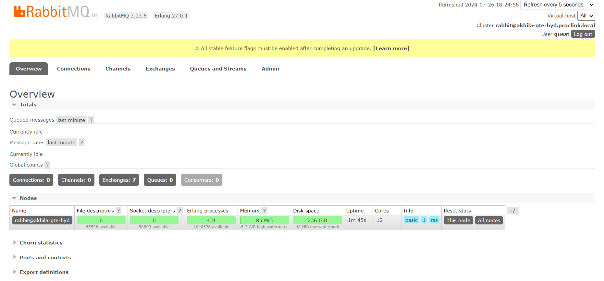

## Azure

- it is a cloud computing platform
- cloud -> renting pc(hardware,software,OS,services,virtual Machine)

## rabbitMQ installation

1. Run the command prompt as Administrator
2. Navigate to the sbin directory and uninstall the service rabbitmq-service remove
3. Reinstall the service rabbitmq-service install
4. Enable the plugins. rabbitmq-plugins enable rabbitmq_management
5. Start the service rabbitmq-service start
6. Go to "http://localhost:15672/"

- Website : 
