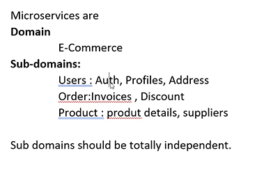
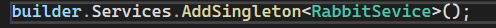

## Javascript in webapi

- all the html,css and javascript files are kept in `wwwroot` folder
- inorder to use / execute these files , we need to add `app.usestaticfiles()` in program.cs

- 

- Example for synchronous
  - 
- example for asynchronous
  - use class `Task.Run()` for making it run parallely / asynchronusly
  - 
- demo :
  - 

### Methods & status codes

# Micro Services

- service -> gives something to perform some action

> Monolithic Application (opposite to micro service)

- presentation layer -> UI
- service layer -> controller
- persistence layer -> model
- 
- 
- 

> drawbacks of monolithic application

- 

> Micro services

- 
- 
- 
- 
- 
- 
- 
- 
- 

> using RabbitMQ , we can communicate with 2 microservices , it also helps in integration (combining)

# RabbitMQ

- RabbitMQ is used for fault tolerance
- MQ -> message-queueing
- in queue the messages are stored in `Byte format`
- 
- 
- 
- 
- 
- 
- 
- rebus methods and manual methods

> steps for manual method

1. step 1 : install this software
   

2. step 2: create class file -> rabbitservice.cs (sending the meassage,store in a queue)

3. step 3: import the namespace
   

   - it has 2 interfaces
     

- durable: Whether the queue should survive a broker restart (set to false here).
- exclusive: If true, the queue is used by only one connection and the queue will be deleted when that connection closes (set to false here).
- autoDelete: If true, the queue is deleted when the last consumer unsubscribes (set to false here).
- arguments: Any additional arguments for the queue (set to null here).

> keys -> ask sir

4. add this line in program.cs
   

5. after executing the program , this is the result in rabbitmq
   
   
   

- for rebus we need to install 3 packages

> Types of exchanges

- 
- 
- 
- 
- 

> summary

