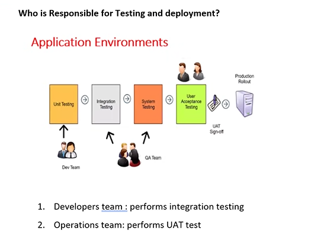

## Docker

- 
- 
- 
- 
- 
- UAT -> User Acceptance test
- SIT -> SOFTWARE INTEGRATION TEST -> developers will perform this test
- 

> types of testing

- 
- 
- operations team -> devops team
- 
- 
- 
- 

> Docker contains

- 

> Container & image

- it contains all required dependencies (runtime + packages + configuration + settings + application)

- how do you create container ?
  - containers are always created from images
- how do you create images ?
  - images are created from docker file
- what is docker file?

  - docker file conatins all configurations and dependency settings which is required to the application

- 
- 
- 
- docker -> a checklist , image -> similar to a class(has actual dependecy) , container -> similar to Object

- 

> docker repository

- online storage,where all the images are stored

> docker commands

- 

> docker desktop

- 

- 

> visual code commands in terminal

- `dotnet new webapi -n Empolyee` -> to create a new project
- `cd Empolyee` -> for changing directory
- `dotnet build` -> to build
- `docker build -t MywebApi .` -> image creation ,here MywebApi is image name
- `docker run -d -p 8009:8080 --name empolyee-container empolyee` -> container creation,here employee(at last) is image name
- `docker tag empolyee akhila0307/empolyee:latest` -> for repository
- `docker push akhila0307/empolyee:latest` -> for pushing into repository
- `docker logout` -> to logout from docker
- `docker pull sumanth0915/employee:latest` -> for pulling others image
- `docker run -d -p 8090:8080 --name sum-con1 sumanth0915/employee` -> to create container with others image

> summary on todays topics

- 
- 
- two ways to test the application
  - 
