## kubernetes

- 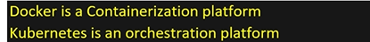
- kubernetes manage the containers
- 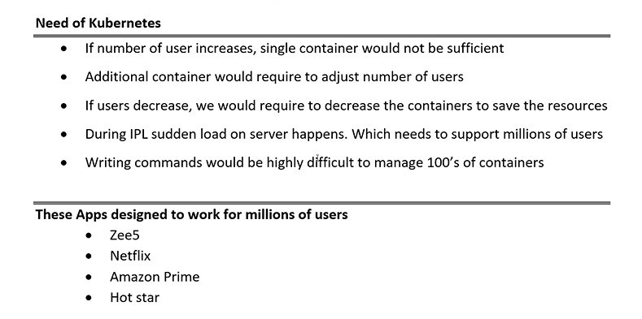
- 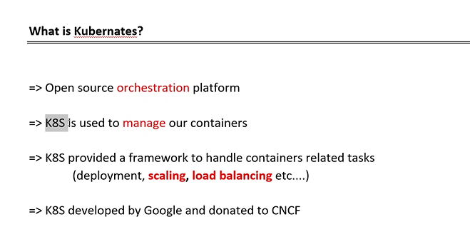
- 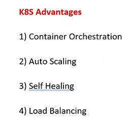
- 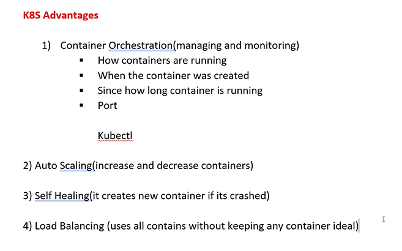
- command for kubernetes : `kubectl`
- 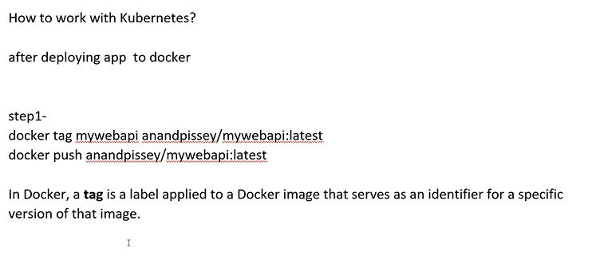

> architecture of kubernetes

- 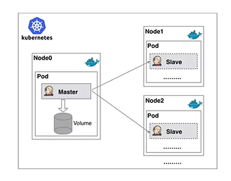
- 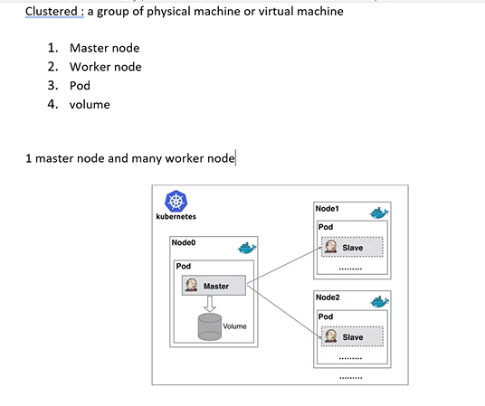
- 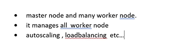
- 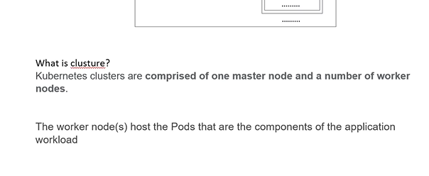
- 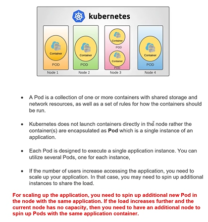

> 2 files to work with kubernetes

1. `deployment.yaml` -> yet another markup language
   - 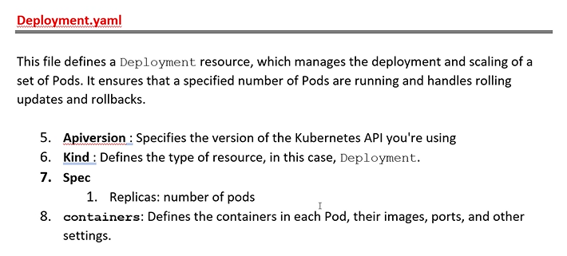
   - 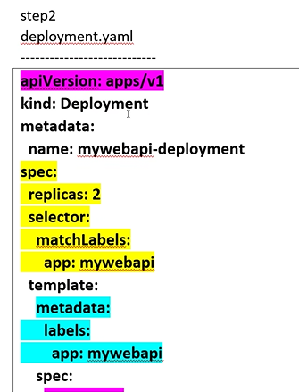
   - 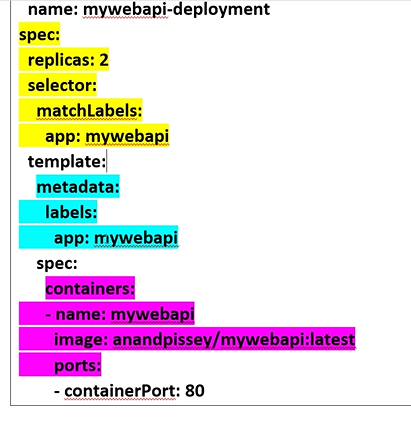
2. `services.yaml`
   - 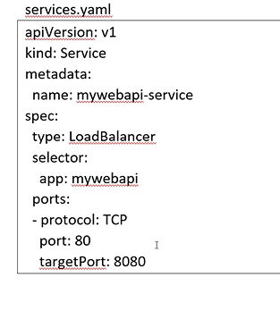
3. step 3:
   - 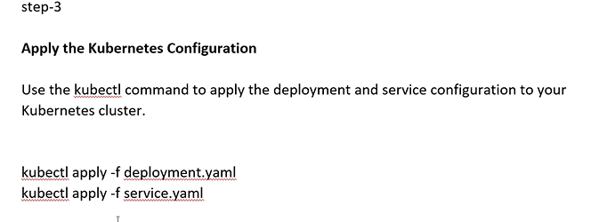
4. step 4:
   - 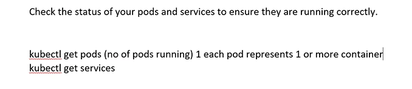
   - 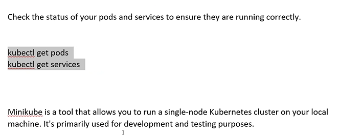
5. step 5:
   - 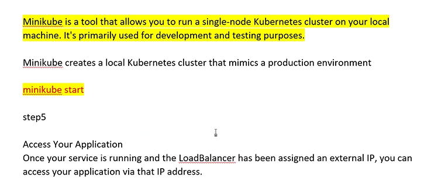
6. step 6:

> kubernetes commands

1. step 1: create deployment.yaml and service.yaml files
2. step 2: run the below commands

   - `kubectl apply -f deployment.yaml`
   - `kubectl apply -f service.yaml`
   - `kubectl get pods` -> to create pods
   - 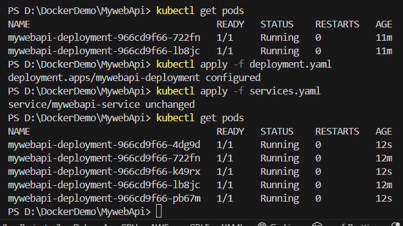
   - `kubectl scale deploy mywebapi-deployment --replicas=7` -> this command can be used inorder to change replicas using terminal , instead of changing it in deployment.yaml file
   - `kubectl delete pods mywebapi-deployment-966cd9f66-4dg9d` -> command to delete the pod,here mywebapi-deployment-966cd9f66-4dg9d is the pod name
   - `kubectl get svc` -> it will show what are the clusters running
   - `curl http://127.0.0.1:8080/weatherforecast` -> to test the application

## BLAZOR

- Blazor hosting options -> 2 types
  - client side
  - server side
- 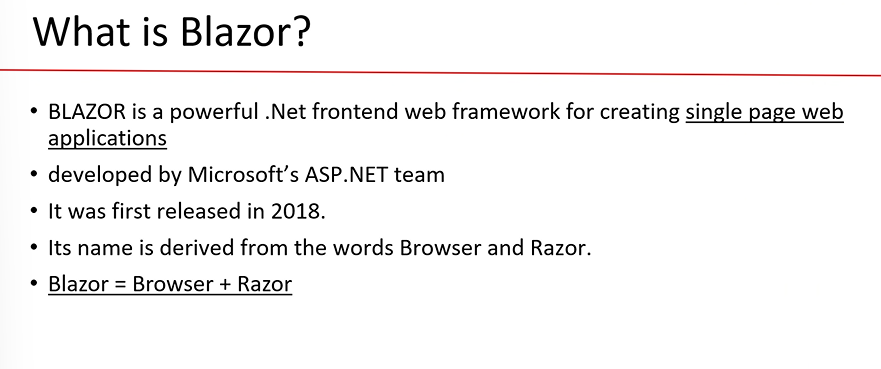
- single page applications(SPA)
- what is SPA ? -> entire web site is single page
- to design a website there are 2 approaches
  1.  multi page application -> login,home,register,feedback
  2.  single page application -> ex : gmail
      - single page is loaded in the browser and contents will be updated dynamically (very much userfriendly for mobile app)
      - 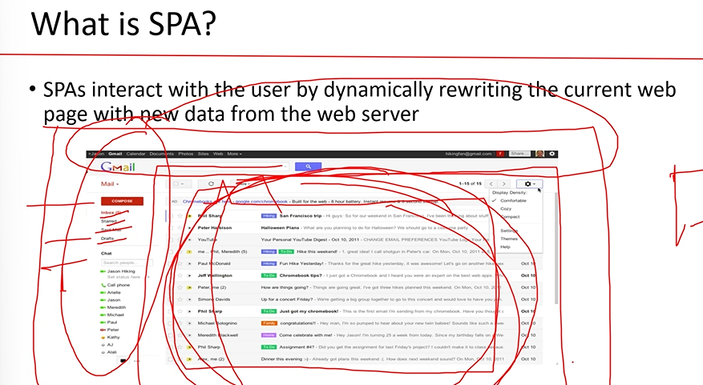

> component vs page

- component : the part where the dynamic data/content is to be replaced
- page : the total page with static data/content and dynamic data/content together known as page

> Features of Blazor

- 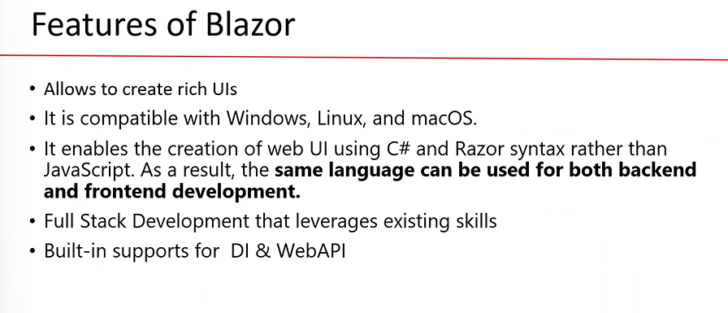
- DI -> dependency injection

> Blazor hosting options

- 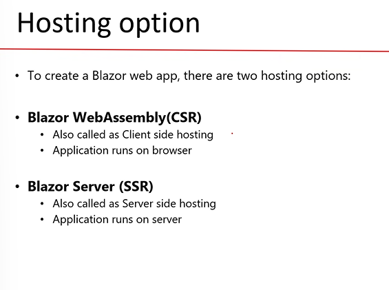
- CSH (client side hosting)
  - all the processing happens in browser(compilation)
- SSH (server side hosting)
  - all the processing happens in server(compilation)

> Blazor web assembly

- C# cannot be executed in browser since it cannot be understood by browser, but in blazor CSH is possible due to `Blazor Web Assembly`
- assembly -> .dll/.exe files
- clr (runtime)-> converts MSIL to binary (since browser cannot understand MSIL code, clr is installed in the browser for converting into binary)
- 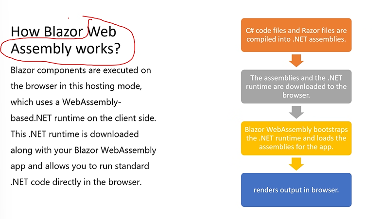
- 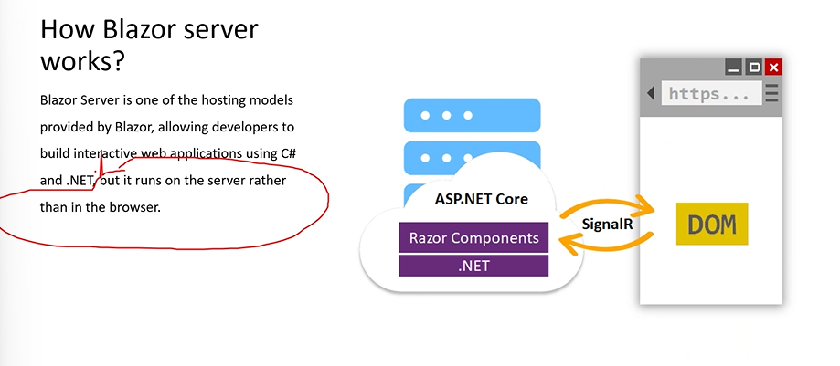

> project structure

- Blazor web assembly -> client side
- Blazor server -> server side
- 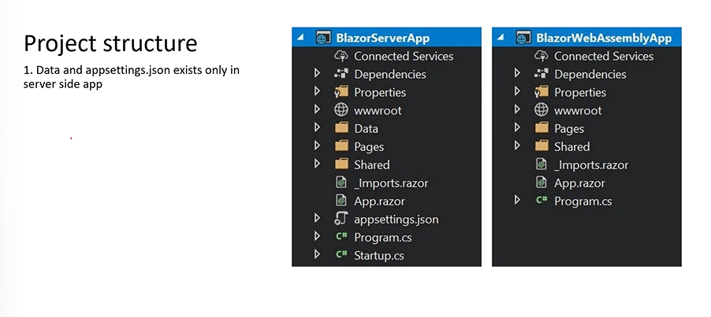

> directives

- 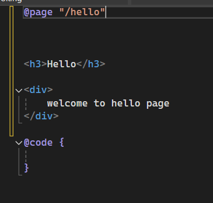
- here `@page "/hello"` is used to call the page . these are called directives
