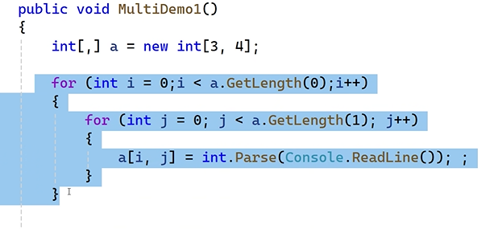
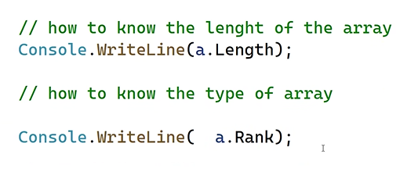
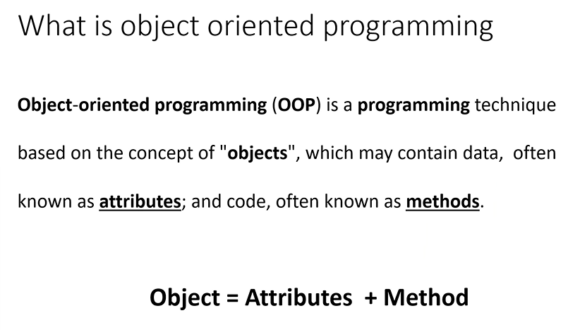
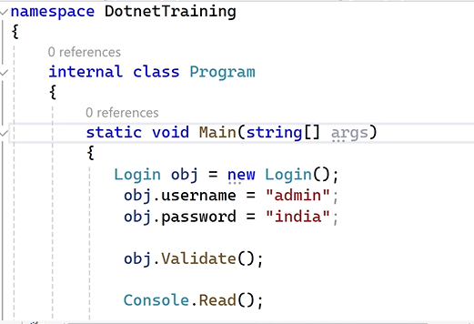
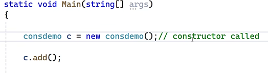

> Access specifiers

- pubic
- private (default)
- protected (only incase of inheritance)
- internal
- protected internal

> Method with parameters

> Methods with optional parameters

> named parameter

> Out keyword

- when we want to return multiple values from a method , we use out keyword

## Arrays

- Collection of variables
  

- 3 types:
  - single dimension -> an array which can hold only one row at a time
    
  - multi dimension -> an array which can hold morethan one row at a time
    
    
    
    - Dynamically take input from user
      
  - jagged array -> it is a type of multi dimension array , but in this case , row is fixed and columns not fixed
    
    

> Loops

> Array methods

> To get values dynamically

- it allocates 3 memory spaces

# Object Oriented Programming

in real life,

- properties -> Data members -> Attributes
- Behaviour -> Functions -> Method

> instead of varaiables , use validations by creating Properties

- `Propfull` command can be used to get the basic code of property in Visual studio
- `prop` command is used if there are not validations . it is called `automatic property`

> Object initializer

> Types of Classes

1. instance class (default): any class which supports object creation is known as instance class (instance means object)

2. static class : it only contains static members only (non static not allowed)(in this case we cannot create objects,we can call members by using class names)
   

3. sealed class : this type of class cannot be inherited(object creation possible)
   

4. abstract class : cannot create object for abstract class but inheritence is allowed
   

5. partial class : this will allow to share the class members in more than 1 file.

> Constructors

- function having the same name as class name
  
  

- 2 types of constructors:
  - instance constructor (called everytime when ever an object is called )
  - static constructor (called only once in a lifetime)

> Property Accessor Visibility

