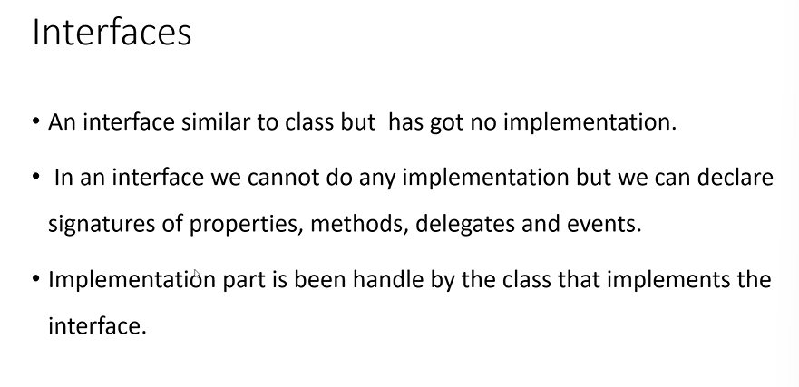

## OOPS Concepts

> Encapsulation -> biggest advantage of it -> security

- we achieve encapsulation by using classes
- u need to merge variable and methods into single class, so that only that class members can access the value.

> Inheritance -> biggest advantage of it -> code reusability

- one class will use the members of another class
- the class which uses the feature is called `derived class/child cls/sub`
- the class which provides the feature is called as `base/super/parent class`
- C# supports only single inheritance.
  

> Polymorphism -> biggest advantage of it -> performance + code flexibility

- poly -> many
- morh -> form
- 2 types :

  1. static/compile polymorphism -> method overloading
     
  2. dynamic/runtime polymorphism -> method overriding

  - minimum 2 classes are required for dynamic polymorphism
  - to achieve dynamic polymorphism we must use inheritance
  - in the base class you need to use virtual
  - in the derived class u need to use override keyword
  - base class can call the derived cls methods using dynamic polymorphism
    
    
    

    - Example

    ```c#

    internal class basecls
    {
        public virtual  void show()
        {
            Console.WriteLine("base class called");
        }
    }

    internal class derivedcls:basecls
    {
        public override void show()
        {
            Console.WriteLine("derived class called");
        }
    }

    basecls ob = new basecls();
    ob.show();
    ob = new derivedcls();
    ob.show();

    ```

> Abstraction -> biggest advantage of it -> code simplicity

- Abstraction -> something which is incomplete
  
  

> Shadowing

- use `new` keyword to implement shadowing
- if u do not wish to override a method , u can use new keyword
- is a way to inform for the user that method is not overridden
  

## Interface



- it should have only declarations , but no implementations


> 1. Proper naming convension

- it will force the class to use the method signature defined in the interface

> 2. Filter the class members

- u can only display the required method for the user

```C#

interface Imathinter
{
     void add(int x, int y);
     void sub(int x, int y);
}

interface Idbinter
{
     void readfromdatabase();
     void storeindatabase();
}
internal class Interfacedemo :Imathinter, Idbinter
{
     public void add(int x, int y)
     {
     }

     public void sub(int x, int y)
     {
     }

     public void readfromdatabase()
     {
         Console.WriteLine("read method called");
     }

     public void storeindatabase()
     {
         Console.WriteLine("store method called");
     }
}
```

> 3. Common method Signature

- u can have 2 methods with same signature having different implementation in a single class

```C#
interface Ione
{
     void Add(int x, int y);
}

interface Itwo
{
     void Add(int x, int y);
}

internal class InterDemo:Ione, Itwo
{
      void Ione.Add(int x, int y)
     {
         Console.WriteLine(x + y);
     }
      void Itwo.Add(int x, int y)
     {
         Console.WriteLine("the sum is " + (x + y));
     }
}


Ione ob = new InterDemo();
  ob.Add(10, 10);

  Itwo ob1 = new InterDemo();
  ob1.Add(10, 10);
```

## Delegates


- 3 steps for delegate:

  1. declare a delegate
  2. point to a method
  3. invoke
     
     

- when u want to pass a logic , use delegates
