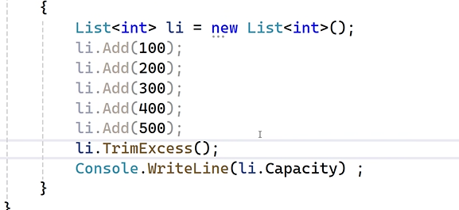
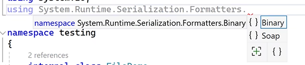

## Generics

- Is a collection of related elements/objects

> Drawbacks of Arrays

- Size is fixed
- dynamic insertion and deletion not possible
- doesn't support sorting and filtering
- does not supports LIFO & FIFO storage

> Advantages of Generics

- Size is not fixed
- dynamic insertion and deletion possible
- supports sorting and filtering
- supports LIFO & FIFO storage

> Classes supported by `System.collections.generics`

- List -> similar to array , where in items are accessed using index position ; supports sorting , filtering and dynamic insertion

- Dictionary -> items are accessed using key instead of index position

- SortedList

- Stack -> items are arranged in last in first out(`LIFO`);
  real time examples of stack : 1. browser history 2. recent orders 3. instagram post 4. youtube comments

- Queue -> items are arranged in first in first out(`FIFO`);
  real tie example: 1. bank token 2. ticket reservation

- Custom class/methods





## Exception Handling

- Compile time errors
- logic errors
- Run time errors
  - wrong datatype
  - file not found error
  - out of bound exception
  - memory exception

Keywords : try , catch , throw , finally, checked


> checked keyword

```C#
try
{
     checked
     {
         byte b = 255;
         int c = ++b + 10;
         Console.WriteLine(c);

     }
}
catch(Exception e)
{

     Console.WriteLine(e.Message);
}
```

## Streams (File Handling)

1. how to create file/store/read/information
   - may be .txt , .xml , .doc
   - realtime examples:
     - logging error
     - serialization
     - to store offline copy data
   - use System.IO


## Serialization

- is a process of converting an object to a stream / file system / network transferable
- 
- Types of serialization:
  - Binary serialization -> data is stored in binary format
    - use this for transferring sensitive data
    - Drawback : only meant to communicate b/w same type of Operating System
    - files are .bin extension
  - soap serialization -> (simple object access protocol)
    - works accross different OS/ Different languages(no restrictions)
    - files are .xml extension
  - Xml -> data is stored in xml format
  - json -> data is stored in json format


