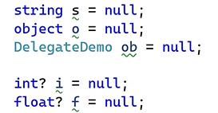
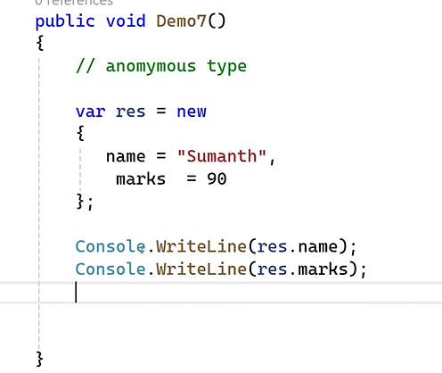

## C# Language Features

- Generics -> introduced in .Net 2.0
- Delegates -> introduced in .Net 3.5
- Named / optional -> 3.0

> Implicit typed local variable -> 3.0

- var -> should be used when we are not sure about data type to be used
  
  - Rules:
    - this feature is applicable only as `Local variable`
    - can't be used as method parameter
    - multiple variable not supported (ex: var m,n,o;)
    - you have to assign the value while declaring
      - 
    - cannot assign Null values
      - 

> Nullable Types

- 
- using nullable types we can assign null values for int, float datatypes
- we achieve nullable types by using `?`
  - 

> Types

- 2 types:
  - Reference types : class, string , interference , object , delegate
  - value type : int, float, double, boolean, byte

> Extension Methods

- 
- we can add new methods to .Net built in type
- RULES:
  - method and class should be static
  - the methods has to take 1 parameter
- 
- 

> InLine Warning

- using inline warning feature we can disable the warning messages
- use `#pragma warning disable` -> disables
- use `#pragma warning restore` -> enables
  
- `#region` & `#endregion`usage
  

> object and collection initializer

> Automatic Properties

> Partial Methods (feature available only in .Net core)

- partial methods can be used only inside partial classes
- partial methods = declaration + implementation
- declaration and implementation happens in 2 different files
- 

> Anonymous Type

> Lambda Expressions

- for single line methods we can use this
- 

> Dynamic support/keyword -> introduced in .net 4.5

- it is same like var , but the problems in var are removed in dynamic
- 
- datatype can be changed for the same variable in dynamic
- 
- 
- problems are resolved only at run time (i.e, the errors are not encountered during compile time,errors are shown only after execution starts)

> Office programability

- 

> Covariance and Contravariance (different)

- 
- 

## LINQ (Language Integrated Query)
