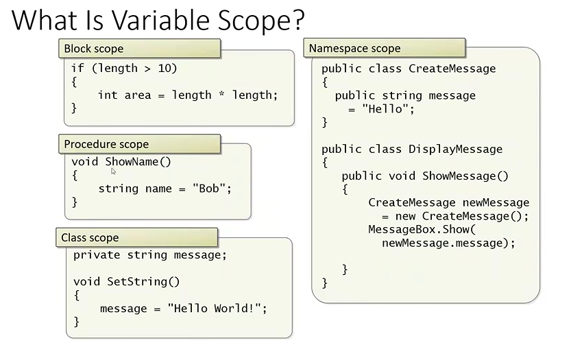
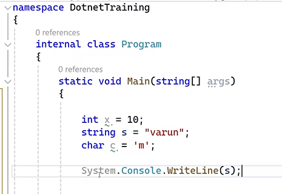

# .NET

- Network enabled Technology
- Platform from Microsoft for building software applications
- Platform : an environment where in all the resources are available to perform a particular task

> Platform in context of .NET

- Framework -> FCL (library) + CLR (JVM)
  - FCL -> Frame work class Library
    - ready to use collection of classes used for developing a particular type of application
    - collection of all dll's constitues FCL
    - these classes are stored in GAC(global assembly cache) folder (c:\windows\assembly)
    - dll -> dynamic link library
    - in .NET we use .exe or .dll files (assembly files : either .dll / .exe)
    - to open a .dll file , we need a .exe file
    - All the classes are stored in DLL
  - CLR -> Common Language Runtime
    - JVM -> converts byte code to (binary format).exe
    - C# program files are saved as `.cs`
    - 
      - MSIL -> microsoft intermediate language
    - 
    - in .NET , CLR converts the MSIL to binary format
    - 
    - 
    - 
    - 
    - 
- IDE's
- Languages
- web services

> variables

> Type cast

- parse -> for only string
- for others , use `convert.`

> cmd commands

- ildsm -> intermediate language dis assembler
